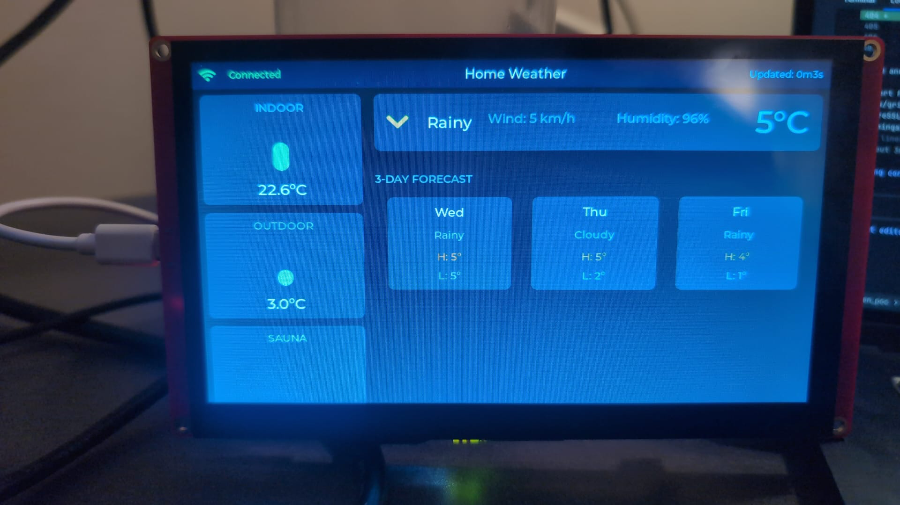

# Home Assistant Weather Dashboard

A weather dashboard running on the ELECROW CrowPanel 7.0" (ESP32-S3) that displays live data from Home Assistant via REST API.



## Features

- **Indoor / Outdoor / Sauna temperatures** with color-coded thermometer bars
- **Current weather** with Material Design weather icons, wind speed, humidity
- **3-day forecast** with icons, high/low temperatures
- **Touch-enabled F/C toggle** to switch temperature units
- **Light/Dark theme toggle** with one tap
- **Auto-refresh** every 30 seconds
- **WiFi auto-reconnect** with status indicator
- **Dark & Light themes** built with LVGL 8

## Hardware

| Component | Details |
|-----------|---------|
| Board | ELECROW CrowPanel 7.0" Basic Series |
| MCU | ESP32-S3-WROOM-1-N4R8 |
| Display | 800x480 RGB LCD (EK9716BD3) |
| Touch | GT911 Capacitive |
| Flash | 4MB |
| PSRAM | 8MB (OPI) |

## UI Layout

```
+------------------------------------------------------------------+
| WiFi | Connected | Home Weather | [theme] [°C] | Updated: 12:34 |  Status bar
+--------------------+---------------------------------------------+
|                    |                                              |
|  INDOOR            |   [Weather Icon]  Rainy    5°C              |
|  [Therm bar]       |   Wind: 5 km/h   Humidity: 96%             |
|    22.6°C          |                                             |
|                    +---------------------------------------------+
|  OUTDOOR           |   3-DAY FORECAST                            |
|  [Therm bar]       |  +--------+  +--------+  +--------+        |
|    3.0°C           |  |  Wed   |  |  Thu   |  |  Fri   |        |
|                    |  | [icon] |  | [icon] |  | [icon] |        |
|  SAUNA             |  | Rainy  |  | Cloudy |  | Rainy  |        |
|  [Therm bar]       |  | H: 5°  |  | H: 5°  |  | H: 5°  |        |
|    24.5°C          |  | L: 0°  |  | L: 1°  |  | L: 3°  |        |
+--------------------+---------------------------------------------+
```

## Prerequisites

- [PlatformIO](https://platformio.org/) (CLI or IDE)
- Home Assistant instance with REST API access
- Long-lived access token from HA (Profile > Security > Long-Lived Access Tokens)

## Configuration

1. Copy the secrets template and fill in your credentials:

```bash
cp src/secrets.h.example src/secrets.h
```

2. Edit `src/secrets.h` with your WiFi and Home Assistant credentials:

```cpp
#define WIFI_SSID     "your_wifi_ssid"
#define WIFI_PASSWORD "your_wifi_password"
#define HA_BASE_URL   "http://homeassistant.local:8123"
#define HA_TOKEN      "your_long_lived_access_token"
```

3. Edit entity IDs in `src/config.h` to match your HA setup:

```cpp
#define HA_ENTITY_INDOOR_TEMP  "sensor.your_indoor_temp"
#define HA_ENTITY_OUTDOOR_TEMP "sensor.your_outdoor_temp"
#define HA_ENTITY_WEATHER      "weather.your_weather_entity"
#define HA_ENTITY_SAUNA_TEMP   "climate.your_thermostat"
```

> **Note**: `src/secrets.h` is gitignored and will not be committed.

## Build & Flash

```bash
# Build
pio run

# Flash (board auto-detected via USB)
pio run -t upload

# Serial monitor
pio device monitor
```

## Project Structure

```
src/
  main.cpp            - Entry point, LVGL timer for 30s HA polling
  config.h            - Entity IDs, display constants (includes secrets.h)
  secrets.h           - WiFi/HA credentials (gitignored - create from secrets.h.example)
  secrets.h.example   - Credentials template with placeholders
  display.h/.cpp      - LovyanGFX display driver + LVGL integration
  touch.h/.cpp        - GT911 touch driver + LVGL input device
  wifi_manager.h/.cpp - WiFi connect/reconnect
  ha_client.h/.cpp    - HA REST API client
  ui.h/.cpp           - LVGL UI layout, update, F/C toggle, light/dark theme toggle
  weather_icons.h     - HA condition -> MDI icon mapping
  weather_font_40.c   - MDI weather icons 40px (current weather)
  weather_font_24.c   - MDI weather icons 24px (forecast cards)
include/
  lv_conf.h           - LVGL configuration
```

## Libraries

| Library | Version | Purpose |
|---------|---------|---------|
| [LovyanGFX](https://github.com/lovyan03/LovyanGFX) | ^1.1.16 | RGB display driver |
| [LVGL](https://lvgl.io/) | ~8.3.11 | UI framework |
| [ArduinoJson](https://arduinojson.org/) | ^7.2.1 | HA REST API JSON parsing |
| [TAMC_GT911](https://github.com/TAMCTec/gt911-arduino) | latest | Capacitive touch driver |

## Weather Icons

Weather icons are rendered using a custom LVGL font generated from [Material Design Icons](https://pictogrammers.com/library/mdi/). Icons are generated with `lv_font_conv`:

```bash
npm install -g lv_font_conv
lv_font_conv --font materialdesignicons-webfont.ttf --bpp 4 --size 40 \
  -r 0xF0590-0xF059E,0xF067E,0xF0F37 --format lvgl --no-compress \
  -o src/weather_font_40.c --lv-include "lvgl.h"
```

Supported HA conditions: sunny, clear-night, cloudy, partlycloudy, fog, rainy, pouring, snowy, snowy-rainy, hail, lightning, lightning-rainy, windy, windy-variant, exceptional.

## HA Forecast API

The dashboard supports two forecast retrieval methods:
1. **Entity attributes** (older HA versions) - reads `attributes.forecast` from the weather entity
2. **Service call** (HA 2024.3+) - `POST /api/services/weather/get_forecasts?return_response`

Both are tried automatically.

## Customization

- **Polling interval**: Change `HA_POLL_INTERVAL_MS` in `config.h` (default: 30000ms)
- **Add/remove temperature sensors**: Modify `HAWeatherData` struct in `ha_client.h` and update `ha_fetch_all()` + `ui_create()`/`ui_update()` accordingly
- **Colors/Theme**: Theme colors are runtime functions in `ui.cpp` (`col_bg()`, `col_card()`, etc.) — edit dark/light palettes there
